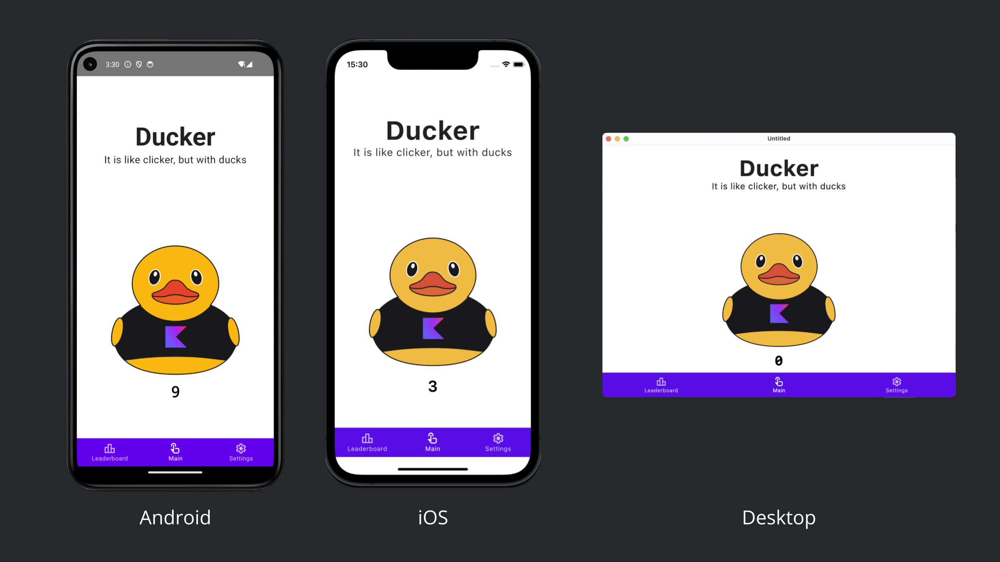
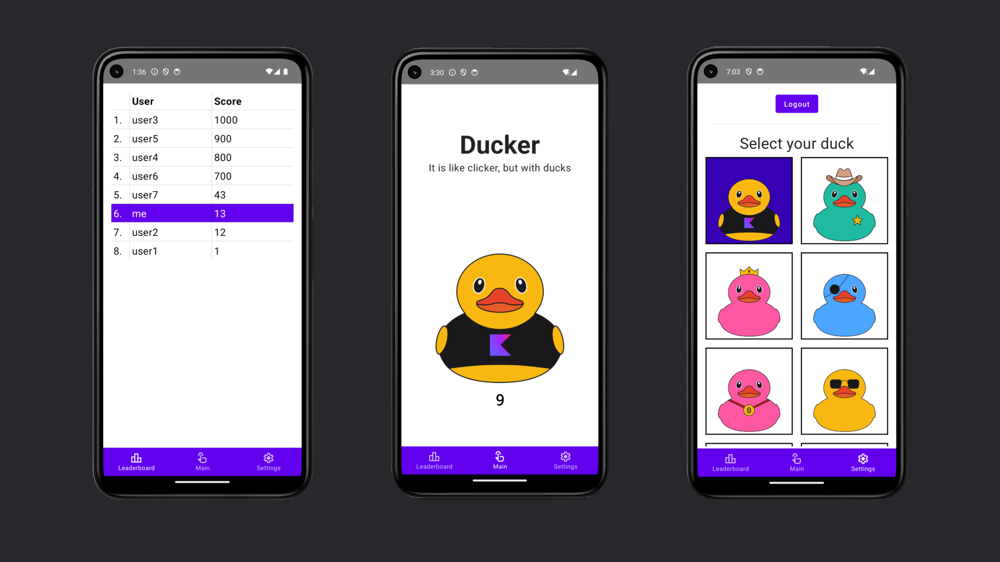

# Ducker

This is the example KMP (Kotlin Multiplatform) project that shows how to use different tools to create an App of our own.

Application:






# Modules overview:

### `/server` is for the Ktor server application.
Server contains logic for handling incoming requests and storing and retrieving data from from db.
To work with the network we use [Ktor](https://ktor.io/) framework. 
To serialize and deserialize requests we use [kotlinx.serialization](https://github.com/Kotlin/kotlinx.serialization).
To work with the database we use [Postgres](https://www.postgresql.org/) JDBC driver and [Exposed](https://github.com/JetBrains/Exposed) framework.

To run your Application from Fleet you can use `Server` run configuration.
To run your local server database use `Local Postgres (Docker)` run configuration. 
You will need to Docker installed locally. You can use [this tutorial](https://www.cprime.com/resources/blog/docker-for-mac-with-homebrew-a-step-by-step-tutorial/) to install Docker.
Alternatively, you can use these command to run docker:
```bash
docker compose up -d
```
Or:
```bash
docker-compose up -d
```
Beware: Docker Compose and Jetpack Compose are different things.

### `/shared` is for the code that will be shared between all targets in the project.
The most important subfolder is [commonMain](shared/src/commonMain). If preferred, you can add code to the platform-specific folders here too.
In [User.kt](shared/src/commonMain/kotlin/User.kt) we store data classes that are used to exchange data between server and client via network. These classes are serialized with kotlinx.serialization library.

### `/composeApp` is for code that will be shared across your Compose Multiplatform applications.
It contains several subfolders:
- [commonMain](composeApp/src/commonMain) is for code that’s common for all targets. Here we have all of our application logic and UI. 
- Other folders are for Kotlin code that will be compiled for only the platform indicated in the folder name.
  For example, if you want to use Apple’s CoreCrypto for the iOS part of your Kotlin app,
  [iosMain](composeApp/src/iosMain) would be the right folder for such calls.
  - [androidMain](composeApp/src/androidMain) is an Android project. It contains `AndroidManifect.xml` file and other configurations.
  - [desktopMain](composeApp/src/desktopMain) is a JVM platform folder that is configured to run Compose Desktop App. 

To run the app in Fleet use `Android` and `Desktop` run configurations respectively.
For Android you need to be careful with the name of the emulator. Check `destination` field.

### `/iosApp` contains [iOS applications](https://developer.apple.com/documentation/xcode/creating-an-xcode-project-for-an-app). Even if you’re sharing your UI with Compose Multiplatform, 
  you need this entry point for your iOS app. This is also where you should add SwiftUI code for your project.

To run the iOS App in Fleet use `iosApp` run configuration.

## Links:
- [Kotlin Multiplatform](https://www.jetbrains.com/kotlin-multiplatform/)
- [Compose Multiplatform](https://www.jetbrains.com/lp/compose-multiplatform/)
- [Kotlin Multiplatform wizard](https://kmp.jetbrains.com/)
- [Fleet](https://www.jetbrains.com/fleet/)
- [Jetpack Compose docs](https://developer.android.com/jetpack/compose/)
- [Layout basics in Compose](https://developer.android.com/jetpack/compose/layouts/basics)
- Animations in Compose (docs and guides)
  - [Animation modifiers](https://developer.android.com/jetpack/compose/animation/composables-modifiers#animation-modifiers)
  - [Keyframes](https://proandroiddev.com/animate-with-jetpack-compose-animate-as-state-and-animation-specs-ffc708bb45f8)
  - [Animatable](https://stackoverflow.com/questions/74903014/how-to-start-and-stop-animation-in-jetpack-compose)
- [Bottom Navigation guide](https://proandroiddev.com/implement-bottom-bar-navigation-in-jetpack-compose-b530b1cd9ee2)
- [No navigation controller for now and alternatives](https://www.jetbrains.com/help/kotlin-multiplatform-dev/compose-navigation-routing.html)
- [Google icons](https://fonts.google.com/icons)
- Resources about screen width in Compose
  - [Stackoverflow](https://stackoverflow.com/questions/68919900/screen-width-and-height-in-jetpack-compose)
  - [Github discussion](https://github.com/JetBrains/compose-multiplatform/discussions/3225)
  - [About density](https://medium.com/@android-world/jetpack-compose-localdensity-pixel-dp-d679370ccf05)
- [No table element out of the box](https://github.com/JetBrains/compose-multiplatform/issues/344)
  - [But there are lists and grids actually, not used in the project though](https://developer.android.com/jetpack/compose/lists)
- [No vertical dividers for now](https://stackoverflow.com/questions/67919041/create-vertical-divider-jetpack-compose)
- SQLDelight
  - [Docs](https://cashapp.github.io/sqldelight/2.0.0/multiplatform_sqlite/)
  - [Linker issue for iOS](https://github.com/cashapp/sqldelight/issues/1442) - for me worked Xcode settings
- Local security checks
  - [Disable for Android Cleartext](https://stackoverflow.com/questions/45940861/android-8-cleartext-http-traffic-not-permitted)
  - [Localhost for Android](https://stackoverflow.com/questions/5806220/how-to-connect-to-my-http-localhost-web-server-from-android-emulator)
  - [Disable for iOS](https://stackoverflow.com/questions/6077888/how-do-i-access-the-host-machine-itself-from-the-iphone-simulator)
- [Presentation](/docs/Presentation.pdf)